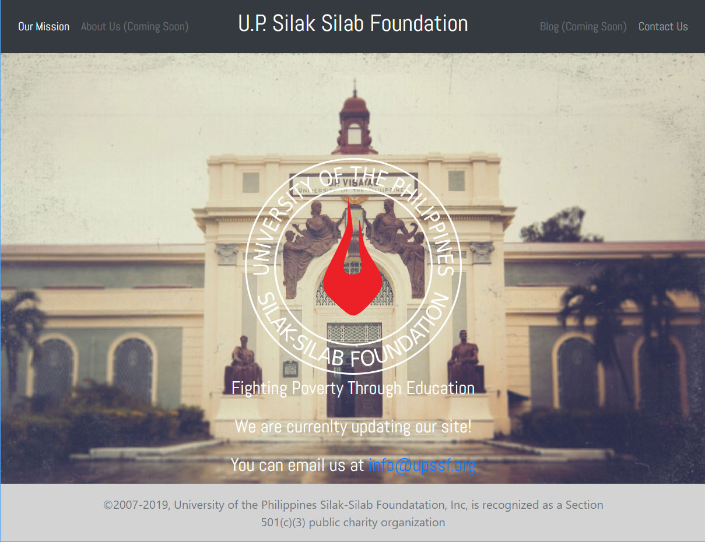

# UPSSF React website
A React JS frontend site for the non-profit organization [The University of the Philippines Silak-Silab Foundation](https://upssf.org). The Foundation’s mission is to liberate poor but deserving students from poverty through access to education. AWS Amplify is used for deployment. Whenever the app's GitHub repository is updated, AWS Amplify automatically deploys the latest version.

## Technologies, APIS, and Frameworks used:
* [ReactJS](https://reactjs.org/) A JavaScript library for building user interfaces
* [Node.js](https://nodejs.org/en/) A JavaScript runtime built on Chrome's V8 JavaScript engine.
* [Bootstrap](https://getbootstrap.com/) An open source toolkit for developing with HTML, CSS, and JS. 
* [AWS Amplify](https://docs.aws.amazon.com/amplify/latest/userguide/getting-started.html) AWS Amplify enables developers to develop and deploy cloud-powered mobile and web apps. The Amplify Framework is a comprehensive set of SDKs, libraries, tools, and documentation for client app development. The Amplify Console provides a continuous delivery and hosting service for web applications.
* [Amazon Route 53](https://docs.aws.amazon.com/Route53/latest/DeveloperGuide/Welcome.html) Amazon Route 53 is a highly available and scalable Domain Name System (DNS) web service. it is used to perform three main functions in any combination: domain registration, DNS routing, and health checking.

## Deployment
Used GH-PAGES to deploy build

### Troubleshooting
https://create-react-app.dev/docs/deployment/

## Static and Media Folders
settings.py
STATIC_URL = '/static/'
MEDIA_URL = '/static/images/'